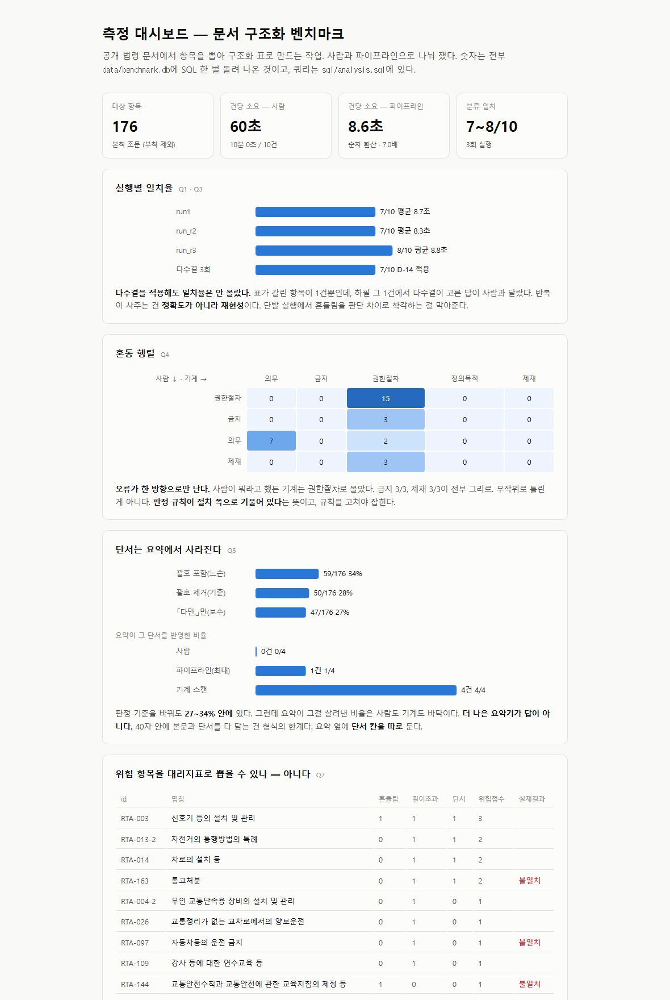

# 문서 구조화 벤치마크 — 사람 vs 파이프라인

장문 문서에서 항목을 뽑아 구조화된 표로 만드는 작업을, 손으로 했을 때와 파이프라인으로 했을 때로 나눠 잰다.

도구 자랑을 하려고 만든 게 아니다. 숫자 하나가 없어서 만들었다.

## 왜 이걸 만들었나

처음부터 AI 에이전트로 일해왔으니 비교할 "손으로 했을 때"가 아예 없다는 뜻이다.

git 이력을 뒤져도 안 나온다. 산출량은 나오는데 소요 시간이 안 나온다. 커밋 간격이 5분에서 2시간까지 들쭉날쭉하고 한 커밋에 파일이 31개씩 한꺼번에 들어오기 때문이다.

표본으로 직접 쟀다.

## 방법 — 측정 전에 고정한다 (2026-08-10)

결과를 보고 기준을 바꿀까 봐 이 절을 측정 전에 썼다. 골든셋을 학습에 한 번도 안 섞는 것과 같은 이유다.

대상은 위키문헌의 「대한민국 도로교통법」이다. 본칙 조문 176개, 약 7.4만 자.

번호가 매겨진 항목이 줄줄이 이어지는 규격 문서의 전형이라 골랐다. 조번호가 ID, 조 제목이 명칭, 조 본문이 세부내용이 된다.

일과 무관한 공개 문서라 그대로 내보낼 수 있다는 것도 컸다.

표본은 `random.seed(20260810)`으로 본문 150~900자 대역(135개)에서 10건을 뽑았다.

대역을 제한한 건 이상치 때문이다. 무제한으로 뽑으면 제2조(정의, 3,789자) 같은 게 걸려 그 한 건이 측정 시간의 대부분을 먹는다.

건당 시간을 비교하려면 항목이 서로 비슷해야 한다고 봤다.

시드를 박은 이유는 따로 있다. 재현 가능해야 하고 뽑고 나서 마음에 안 든다고 다시 뽑지 않기 위해서다.

> 표본은 파서 정정 전 목록에서 뽑혔다. 시드로 다시 뽑으면 다른 10건이 나온다.
>
> 측정을 끝낸 뒤 파서가 부칙을 본칙과 같이 세고 있던 것을 발견해 고쳤다(210 → 176개). 대역 크기도 135에서 124개가 됐다. 측정 자체는 유효하다. 표본 10건이 전부 본칙이고, 본문도 정정 전후가 글자 단위로 같다. 그래서 표본은 다시 뽑지 않는다. 다시 뽑으면 사람이 이미 채운 골든셋을 버리게 되고, 그건 결과를 보고 표본을 고르는 것과 구분이 안 된다. 재현하려면 `data/sample_10.json`을 그대로 쓴다. 파서를 어떻게 고쳤는지는 아래 「SQL로 다시 재기」 절에 있다.

과제는 조문 하나당 두 칸이다. 분류는 다섯 종(`의무`·`금지`·`권한절차`·`정의목적`·`제재`) 중 하나를 고르고 완전일치로 채점한다. 요지는 40자 이내 한 줄이고 사람이 읽고 판정한다.

ID와 명칭은 미리 채워뒀다. 기계적인 옮겨 적기라 판단이 안 들어간다. 그 시간을 빼면 파이프라인 쪽이 덕을 못 본다.

일부러 보수적으로 잡았다.

판정 규칙 네 개는 `manual/worksheet.md`에 있다. 이게 이 저장소의 핵심 자산이라고 본다.

재는 것은 셋이다. 건당 소요 시간, 분류 일치율, 그리고 갈린 조문. 마지막 게 라벨링 가이드의 재료가 된다.

순서가 중요했다. 사람이 먼저 채운다. 파이프라인 출력을 보기 전에.

사람이 끝난 뒤에 파이프라인을 돌린다. 그다음에 채점한다. 사람이 AI 출력을 먼저 보면 그 순간 측정이 아니라 검토가 된다.

한계는 미리 적어둔다.

n은 10이고 통계적 유의성을 주장하지 않는다. "대략 몇 배"까지가 이 표본이 말할 수 있는 전부다.

파이프라인 쪽은 배치 시스템이 아니라 대화형 한 번의 호출이다. 실제 파이프라인이라면 API 호출과 재시도와 검증 단계가 붙어 더 걸린다.

사람 쪽은 1인 1회고 컨디션과 숙련도가 섞여 있다.

분류 다섯 종도 내가 만든 것이라 법학의 표준 분류가 아니다. 재려는 건 법 해석 능력이 아니라 기준을 정해놓고 그대로 적용하는 능력이다.

## 결과

| | 사람 | 파이프라인 | 배수 |
|---|---|---|---|
| 완료 건수 | 10 / 10 | 10 / 10 | — |
| 총 소요 | 10분 00초 | 20.5초 (동시 5, 3회 평균) | |
| 건당 | 60.0초 | 2.1초 | 29배 |
| 건당 (순차 환산) | 60.0초 | 8.6초 | 7.0배 |
| 분류 일치 | — (골든셋) | 7~8 / 10 | |
| 요지 40자 규칙 준수 | 2 / 10 | 10 / 10 | |

파이프라인은 조문당 `claude` CLI를 독립 호출한다. 29배는 병렬 실행 기준이고 7배는 순차 환산이다.

쓸 숫자는 7배로 정했다. 보수적인 쪽을 쓴다.

속도보다 눈에 띈 건 제약 준수 쪽이었다. 요지 40자 규칙을 사람은 10건 중 8건에서 어겼고(평균 52자, 최대 79자), 파이프라인은 3회 실행 30건 중 29건을 지켰다(평균 32자).

기계는 적어둔 제약을 지킨다. 사람은 내용에 빠지면 형식을 잊는다.

불일치는 세 건이었다. 같은 입력과 같은 프롬프트로 3회 반복해서 갈랐다.

| 조문 | 사람 | 파이프라인 | 정체 |
|---|---|---|---|
| RTA-097 (자동차등의 운전 금지) | `금지` | `권한절차` ×3 | 일관된 판단 차이 |
| RTA-163 (통고처분) | `제재` | `권한절차` ×3 | 일관된 판단 차이 |
| RTA-144 (교통안전수칙 제정) | `의무` | `권한절차`×2 / `의무`×1 | 모델 흔들림 |

두 건의 판단 차이는 같은 모양이다. 결과 대 기제.

사람은 "이 조문이 있으면 무엇이 일어나나"(운전이 금지된다, 범칙금이 부과된다)를 읽었다. 파이프라인은 "누가 어떤 절차로 하나"(지방경찰청장의 처분 권한, 경찰서장의 통고 절차)를 읽었다.

둘 다 원문을 정확히 읽었다.

갈린 이유는 판정 규칙 4가 기제 쪽으로 밀고 규칙 2가 이 경우를 못 가르는 데 있었다. 어느 쪽의 오류도 아니라 내 규칙의 결함이었다.

골든셋을 만드는 목적이 정확히 이걸 찾는 것이다.

자기일관성은 10건 중 8건 안정, 2건 흔들림이었다. RTA-003이 4회 관측 중 1회, RTA-144가 3회 중 1회 다른 값을 냈다. 단발 실행의 정확도는 그 자체로 신뢰할 수 없다.

기존 규칙 4가 불이익 처분까지 `권한절차`로 빨아들이는 게 문제였다. 규칙 5를 추가한다.

> 행정청이 불이익(금지·제재)을 부과하는 조문은, 절차 서술이 있더라도 그 불이익의 성격(`금지`/`제재`)으로 분류한다. 규칙 4는 의무·급부 절차에만 적용한다.

다음 라운드는 이 규칙으로 다시 잰다. 개정 전 결과를 지우지 않고 같이 남긴다. 규칙을 바꿔서 점수가 올라간 것인지 구분할 수 있어야 하니까.

---

# 두 번째 측정 — 단서는 요약에서 사라진다

첫 측정이 속도를 쟀다면 이건 누락을 잰다. 새 작업을 시키지 않는다. 위에서 이미 모은 답을 다른 각도로 봤다.

규격 문서의 항목에는 본문을 한정하거나 뒤집는 단서가 붙는다. 본문만 읽고 단서를 흘리면 결론이 정반대로 간다.

실제로 그런 사고를 봤다. 본문이 요구하는 것과 단서가 요구하는 것이 반대였다. 본문만 읽은 해석이 그대로 산출물에 들어갔다.

그럼 이게 얼마나 흔한가. 요약은 얼마나 살려낼까.

| 판정 기준 | 단서 포함 항목 |
|---|---|
| 괄호 포함 (느슨) | 59 / 176 (34%) |
| 괄호 제거 (기준) | 50 / 176 (28%) |
| 「다만,」만 (보수) | 47 / 176 (27%) |

`(광역시의 군수는 제외한다)` 같은 정의용 괄호는 단서가 아니다. 그냥 `제외한다`로 세면 이런 것까지 걸린다.

괄호를 지우고 센 28%를 쓴다. 기준을 바꿔도 27~34% 안에 있다. 표본 10건 중 단서를 가진 것은 4건이다. 세 기준 모두 같은 4건을 가리킨다.

| | 단서 반영 |
|---|---|
| 사람 요약 | 0 / 4 |
| 파이프라인 요약 (3회) | 0 / 4 · 1 / 4 · 1 / 4 |
| 기계 스캔 | 4 / 4 (정규식 한 줄, 176개 전수 0.0초) |

파이프라인이 한 번 잡은 것도 "…절차와 예외를 정한 조문", 딱 한 단어였다. 무슨 예외인지는 안 나온다.

세 줄로 줄이면 이렇다.

규격 문서 항목의 28%에 본문을 한정하는 단서가 붙어 있는데 요약하면 사라진다. 흘리면 결론이 반대로 간다. 요약과 별개로 단서 신호를 기계적으로 스캔해 항목마다 플래그를 붙였다. 단서 반영률은 사람 0/4, LLM 0~1/4에서 기계 스캔 4/4로 올라간다. 전수 검사에 0.0초 걸린다.

사람도 LLM도 똑같이 흘렸으니 요약기 성능 문제가 아니다.

40자 안에 본문과 단서를 다 담는 건 물리적으로 어렵다. 요약의 결함이 아니라 요약이라는 형식의 한계다.

답은 "요약을 더 잘하게"가 아니라 "요약 옆에 단서 칸을 따로"라고 봤다. 기계 스캔은 판단을 안 한다. "여기 단서 있으니 사람이 보라"고만 한다.

그거면 된다.

두 측정이 맞물리는 지점이 여기다.

첫 측정에서 40자 제약은 미덕이었다. 기계는 지켰고 사람은 어겼다. 형식이 곧 품질인 산출물에서 자동화의 값어치가 거기서 나온다.

두 번째 측정에서 같은 40자가 비용이었다. 단서를 잘라냈다. 양쪽 다 그랬다.

같은 제약이 한쪽에선 미덕이고 다른 쪽에선 비용이었다. 제약을 없앨 일이 아니다. 제약 때문에 잘리는 것을 다른 칸에서 받기로 했다.

한계도 적어둔다.

반영 판정이 거칠다. 요약에 `다만`·`예외`·`제외`·`단서` 같은 낱말이 있는지로 기계 판정했다. 후하게 잡아준 기준인데도 최대 1/4이다. 엄밀하게 보면 더 낮다.

n은 4다. 비율 28%는 176건 전수라 단단하지만 반영률 쪽 표본은 작다. 표본이 단서 쪽으로 조금 치우치기도 했다. 말뭉치는 28%인데 표본에서는 40%(4/10)다. 우연이다. 표본이 작을 때 흔한 일이다.

그리고 단서가 다 중요한 건 아니다. 28% 중 실제로 결론을 뒤집는 게 몇 %인지는 아직 안 쟀다.

---

# SQL로 다시 재기 — 그리고 파서 정정

측정 기록이 JSON 파일 일곱 개에 흩어져 있어서 "실행별로 나눠 보기"나 "단서가 있는 항목만 골라 보기" 같은 질문에 매번 스크립트를 새로 짜야 했다. 조인 한 번이면 되는 일이다.

SQLite로 적재하고([`sql/schema.sql`](sql/schema.sql)) 질문 일곱 개를 쿼리로 썼다([`sql/analysis.sql`](sql/analysis.sql)). 결과는 자립형 대시보드로 굽는다([`dashboard/index.html`](dashboard/index.html)).

설치할 것은 없다. 파이썬 표준 라이브러리의 `sqlite3`만 쓴다.

```bash
python sql/load.py && python sql/build_dashboard.py
```



이 그림을 README에 넣으려고 처음으로 브라우저에서 열어봤다. 혼동 행렬 머리글이 `사람 ₩ 기계`로 나와 있었다. 역슬래시를 한글 폰트가 원화 기호로 그린 것이다. 화살표로 바꿨다.

고치는 데 1분 걸렸다. 다만 화면을 만들어놓고 한 번도 안 열어봤다는 건 짚어둔다.

이 저장소는 "쟀느냐"를 계속 따진다. 정작 눈으로 확인하는 걸 건너뛴 자리가 있었다.

`article.id`에 `PRIMARY KEY`를 걸자 적재가 즉시 실패했다. 중복 ID가 있었다.

원인은 부칙이었다. 부칙을 본칙과 같이 세고 있었다. 부칙은 조 번호가 1부터 다시 시작한다. 시행일이나 경과조치를 담는 자리다. 「제3조」가 여섯 개 있었던 이유다.

추가로 제84조는 개정 전후 두 판본이 실려 있었다. 원본 문서의 특성이지 파서 버그는 아니다. 마지막 판본을 채택하고 무엇을 버렸는지 찍게 했다.

| | 정정 전 | 정정 후 |
|---|---|---|
| 항목 수 | 210 (부칙 37 포함, 중복 34) | 176 (본칙, 중복 제거) |
| 단서 비율 (기준) | 58/210 = 28% | 50/176 = 28% |

결론은 바뀌지 않았다. 비율이 28%로 같고 기준을 바꿔도 27~34% 안에 있다. 표본 10건도 전부 본칙이라 측정은 그대로 유효하다.

그래도 항목 수는 틀린 값이었다. JSON 파일로 두는 동안 아무도 물어보지 않다가, 제약을 하나 선언하자 1초 만에 드러났다.

느슨한 자료구조는 틀린 데이터를 조용히 품는다고 봤다. 이 저장소에서 계속 같은 데 걸렸다.

SQL이 새로 알려준 것도 셋 있다.

첫째, 다수결은 정확도를 안 올린다(Q3). 반복 실행에 다수결을 기본으로 하자던 결론을 실제로 계산해봤더니 일치율은 70%로 그대로였다. 표가 갈린 항목이 1건뿐이고 거기서 다수결이 고른 답이 사람과 달랐기 때문이다.

반복이 사주는 건 정확도가 아니라 재현성이었다. 흔들림을 판단 차이로 착각하는 걸 막아준다.

그것만으로도 할 이유는 되지만 뭘 얻는 건지는 정확히 말해야 한다.

둘째, 오류가 한 방향으로만 난다(Q4 혼동 행렬). 사람이 뭐라고 했든 기계는 `권한절차`로 몰았다. 금지 3/3, 제재 3/3이 전부 그리로.

무작위로 틀린 게 아니라 판정 규칙이 절차 쪽으로 기울어 있다는 신호다. 규칙 5가 겨냥한 자리를 데이터가 짚어준 셈이다.

셋째, 위험 항목을 대리지표로 뽑으려던 시도는 실패했다(Q7). 모델 흔들림과 요지 길이 초과와 단서 유무를 더해 위험점수를 만들어봤는데 실제 불일치와 안 맞는다. 3점짜리는 일치했고 불일치 3건은 2·1·1점이다.

확신도는 대리지표로 못 때운다. 사람에게 직접 물어야 했다.

실패한 가설이라 더 값지다고 봐서 대시보드에 그대로 남겼다.

부수적으로 본문 길이와 호출 시간은 무관했다. 짧은 절반이 9.0초, 긴 절반이 8.2초다(Q6). 비용을 입력 길이로 추정하면 틀린다.

---

## 돌려보려면

파이썬 3.12에서 만들었고 외부 패키지를 안 쓴다. `sqlite3`도 `json`도 표준 라이브러리라 `pip install`할 게 없다.

하나만 별도다. `run_pipeline.py`는 조문마다 `claude` CLI를 직접 호출한다. 그게 없으면 파이프라인 쪽 측정을 못 돌린다. 사람 쪽 측정과 채점과 SQL 적재와 대시보드는 CLI 없이 전부 돈다.

| | |
|---|---|
| 파이썬 | 3.12에서 확인했다. 3.9 이상이면 될 것으로 보이지만 재보지 않았다 |
| 운영체제 | Windows 11에서 쟀다. 경로를 하드코딩한 데가 없어 macOS·리눅스도 될 텐데 확인은 안 했다 |
| 외부 패키지 | 없음 |
| 별도 도구 | `claude` CLI — `run_pipeline.py`에만 필요하다 |
| 걸리는 시간 | 파이프라인 3회 약 1분, 나머지는 각각 1초 안팎. 사람 쪽만 10분 |

```bash
python scripts/parse_law.py data/raw.html data/articles.json
python scripts/make_worksheet.py
python scripts/timer.py start   # 사람 작업 시작
python scripts/timer.py stop    # 사람 작업 종료
python scripts/run_pipeline.py --workers 5      # 파이프라인 (반복 시 --tag _r2)
python scripts/score.py                          # 첫 측정 채점
python scripts/clause_check.py                   # 두 번째 측정
python sql/load.py && python sql/build_dashboard.py   # SQL 적재 + 대시보드
```

원본 HTML은 `data/raw.html`에 그대로 넣어뒀다. 위키문헌은 계속 바뀐다. 재현하려면 이 파일을 쓴다.

```
data/                       원본 · 파싱 결과 · 골든셋 · 실행 기록  → data/README.md (출처·라이선스)
manual/source_10.md         표본 원문 — 사람이 읽은 것
manual/worksheet.md         작업지 — 빈 서식과 판정 규칙
manual/worksheet_filled.md  사람이 채운 것 — 골든셋 원본
scripts/parse_law.py        원본 → 조문 파싱
scripts/make_worksheet.py   표본 → 원문·작업지 생성
scripts/timer.py            사람 작업 시간 기록
scripts/run_pipeline.py     파이프라인 (조문당 독립 호출)
scripts/score.py            첫 측정 채점 — 일치율·자기일관성·시간
scripts/clause_check.py     두 번째 측정 — 단서 반영률
sql/schema.sql              테이블 정의
sql/load.py                 JSON → SQLite 적재
sql/analysis.sql            질문 일곱 개
sql/build_dashboard.py      쿼리 → 자립형 HTML
dashboard/index.html        대시보드 (외부 요청 0건)
```

여기서 나온 셋, 그러니까 반복 실행과 확신도와 불일치를 규칙 개정 목록으로 읽는 것을 실제 작업 구조에 넣은 게 [agent-workflow](https://github.com/serenwoon/agent-workflow)다. 문서 작업을 에이전트로 돌릴 때 틀린 결과가 조용히 통과하지 않게 만든 판정 루프다.

---

## 지금 상태

측정 두 건은 끝났다. 위에 적힌 숫자가 전부다. 다시 재서 덮어쓸 생각은 없다.

안 끝난 것도 셋 있다.

규칙 5를 만들어놓고 그 규칙으로 2라운드를 아직 안 돌렸다. 개정이 실제로 불일치를 줄이는지는 그러니까 모르는 상태다. 돌리게 되면 개정 전 결과를 지우지 않고 나란히 남긴다. 규칙을 바꿔서 점수가 올라간 것인지 구분이 돼야 하니까.

작업지의 「판단이 갈렸던 조문」 칸이 거의 비어 있다. 칸은 만들어놨는데 채운 건 RTA-003 한 건뿐이다. 어디서 망설였는지가 판정 규칙의 다음 결함을 가리키는 자리인데, 정작 그걸 안 적었다.

n이 10이다. 이걸로는 "대략 몇 배"까지가 끝이다.

## 라이선스

코드와 문서는 MIT([`LICENSE`](LICENSE)).

원본 법령과 거기서 파생된 데이터는 조건이 다르다. 내 것이 아니라서, 출처와 라이선스를 [`data/README.md`](data/README.md)에 따로 적어뒀다.
